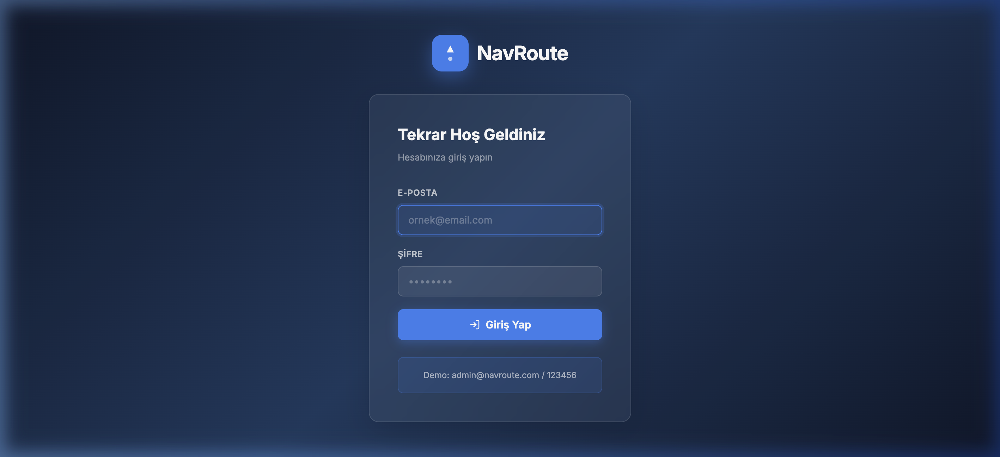
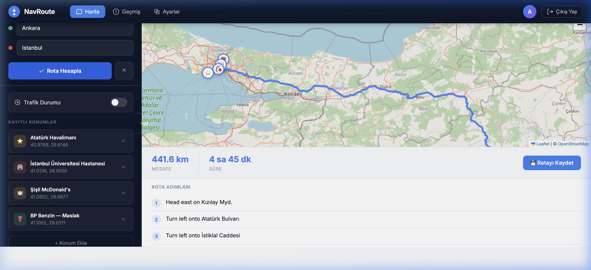
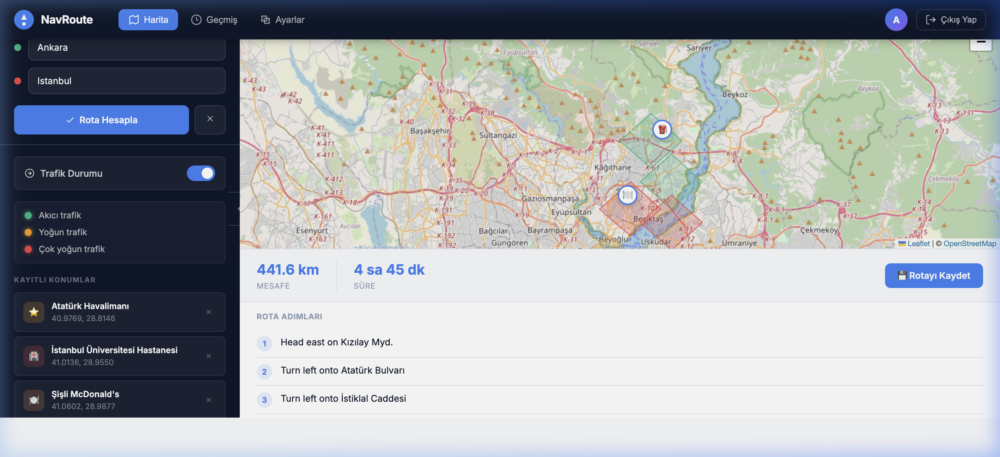
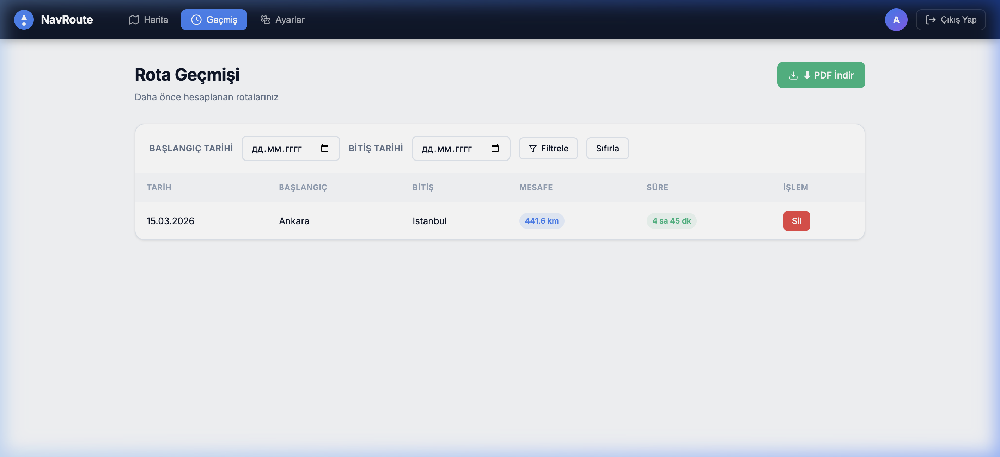
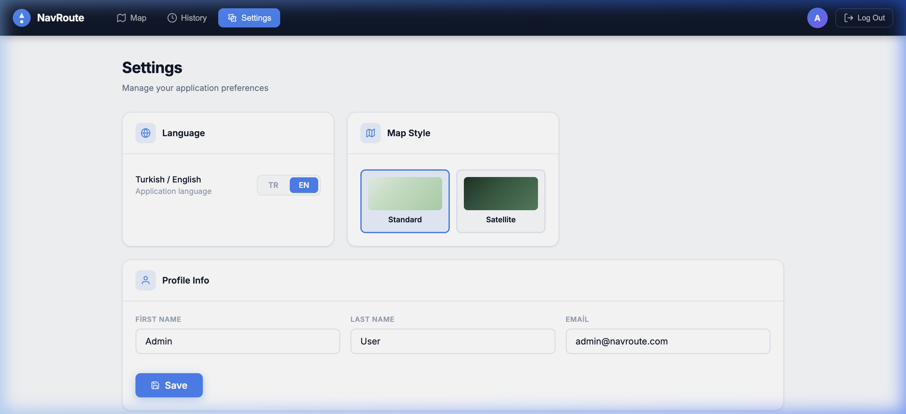

# NavRoute — Walkthrough

**NavRoute** — навигационное веб-приложение на HTML/CSS/JavaScript + Leaflet.js + OpenStreetMap.

---

## 🚀 Как запустить

Откройте файл напрямую в браузере (сервер не нужен):

```
index.html
```

**Демо-логин:** `admin@navroute.com` / `123456`

---

## 📄 Страницы

### 1. Страница входа (Login)

Glassmorphism-карточка, поля e-mail + пароль, кнопка «Гириш Яп», подсказка с demo-данными.



---

### 2. Карта — расчёт маршрута

Ankara → Istanbul: реальный маршрут через OSRM — **441.6 км / 4 ч 45 мин**. Пошаговые инструкции в нижней панели. Сохранённые POI отображаются как emoji-маркеры на карте.



---

### 3. Трафик

Переключатель «Trafik Durumu» рисует цветные зоны по Стамбулу:
- 🟢 Зелёный — свободно (Beşiktaş, Şişli)
- 🟡 Жёлтый — умеренно (Eminönü, Kadıköy)
- 🔴 Красный — пробки (Taksim, Üsküdar)



---

### 4. История маршрутов

Таблица сохранённых маршрутов с датой, расстоянием, длительностью. Фильтрация по диапазону дат. Экспорт в PDF через jsPDF.



---

### 5. Настройки (EN-режим)

Переключение языка TR/EN, выбор стиля карты (Стандарт / Спутник), редактирование профиля — всё сохраняется в `localStorage`.



---

## 📁 Структура файлов

```
navroute/
├── index.html          # SPA-оболочка, подключение CDN
├── styles.css          # Дизайн-система (CSS-переменные, все компоненты)
├── app.js              # Роутер, i18n (TR/EN), хранилище состояния
├── pages/
│   ├── login.js        # Страница входа
│   ├── map.js          # Карта Leaflet, маршруты, трафик, POI
│   ├── history.js      # История маршрутов, фильтр, PDF-экспорт
│   └── settings.js     # Настройки языка, стиля, профиля
├── schema.sql          # SQL Server DDL — 5 таблиц
├── api_notes.md        # Структура C# ASP.NET Core 8 Web API
└── docs/
    └── WALKTHROUGH.md  # Этот файл
```

---

## 🗄️ База данных (SQL Server)

Таблицы: `Kullanicilar`, `Konumlar`, `Rotalar`, `TrafikDurumu`, `Favoriler`  
Полная схема: [`schema.sql`](../schema.sql)

---

## ⚙️ Backend (C# ASP.NET Core 8)

REST API структура, эндпоинты, session-аутентификация, Entity Framework Core:  
[`api_notes.md`](../api_notes.md)

---

## 🛠️ Технологии

| Слой | Технология |
|------|-----------|
| Frontend | HTML5, CSS3, Vanilla JavaScript |
| Карты | Leaflet.js + OpenStreetMap |
| Маршрутизация | Leaflet Routing Machine + OSRM |
| PDF | jsPDF + jspdf-autotable |
| Backend (ref) | C# ASP.NET Core 8 |
| БД (ref) | SQL Server |
